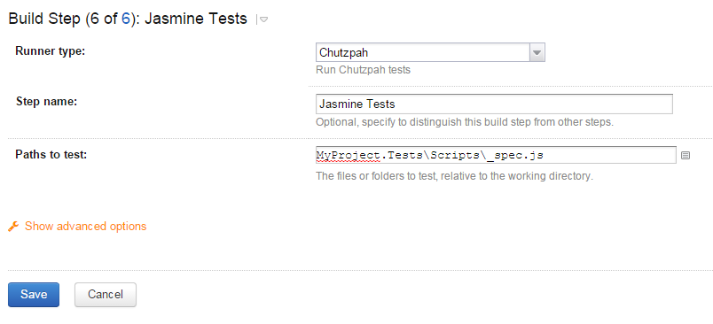

Chutzpah meta-runner for TeamCity
==================================

This meta-runner allows you to run [Chutzpah](http://mmanela.github.io/chutzpah/) tests inside of TeamCity without needing to install anything further on your server. It will automatically install Chutzpah and PhantomJs from Chocolatey after ensuring Chocolatey exists on that server (it installs Chocolatey for you if it's not already there). It will then execute Chutzpah against the path(s) you provide and output the appropriate test statuses to TeamCity.

Chutzpah Runner
----------------

The following options can be specified:
* Path(s) to test - The list of file paths to test with paths relative to the working directory

Further configuration can be achieved by placing a [chutzpah.json](https://github.com/mmanela/chutzpah/wiki/Chutzpah.json-Settings-File) file in your source.

Known Issues
------------

1. Once this gets Chutzpah (and PhantomJs) installed on the server from Chocolatey it will never try and update it. It could include a call to cinst to update it if necessary every run, but that will add at least 1-2s (if not more) to every build run due to Chocolatey's slowness. That's why it checks the filesystem for chocolatey rather than invoking a Chocolatey command to see if it already exists.
2. Due to difficulties passing dynamic variables between meta-runner runners this meta-runner only works with Chocolatey > 0.9.8.27 and where Chocolatey is installed to %ProgramData%\Chocolatey.
3. Due to incompatible command line arguments, this meta-runner only works with Chocolatey > 0.9.8.32