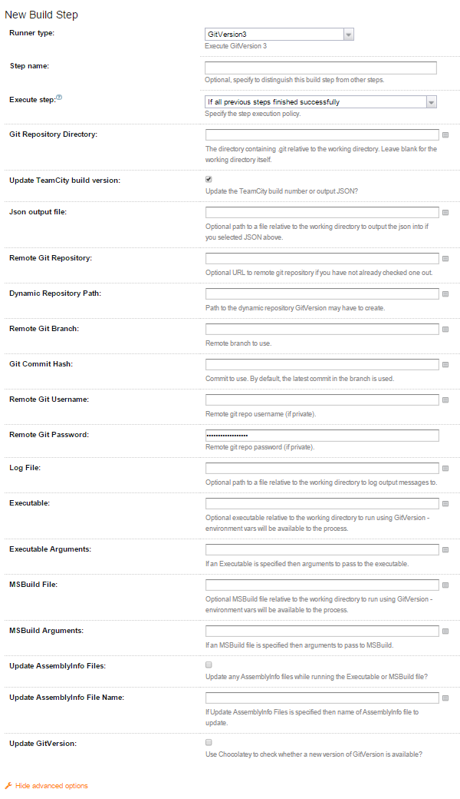

GitVersion meta-runner for TeamCity
===================================

This meta-runner allows you to get up and running with [GitVersion](https://github.com/Particular/GitVersion) inside of TeamCity without needing to install anything further on your server. It will automatically install GitVersion from Chocolatey after ensuring Chocolatey exists on that server (it installs Chocolatey for you if it's not already there).

GitVersion is the easy way to use semantic versioning (semver.org) with Git. GitVersion uses your git repository branching conventions to determine the current [Semantic Version](http://semver.org/) of your application. It supports [GitFlow](https://github.com/Particular/GitVersion/wiki/GitFlow) and the much simpler [GitHubFlow](https://github.com/Particular/GitVersion/wiki/GitHubFlow) and might work with others (let us know).

See the [GitVersion repository](https://github.com/Particular/GitVersion) for more information.

GitVersion Runner
-----------------

The following options can be specified:
* Git Repository Directory: The directory containing .git relative to the working directory. Leave blank for the working directory itself.
* Update TeamCity build version: Update the TeamCity build number or output JSON?
* Json output file: Optional path to a file relative to the working directory to output the json into if you selected JSON above.
* Remote Git Repository: Optional URL to remote git repository if you have not already checked one out.
* Remote Git Branch: Remote branch to use.
* Remote Git Username: Remote git repo username (if private).
* Remote Git Password: Remote git repo password (if private).
* Log File: Optional path to a file relative to the working directory to log output messages to.
* Executable: Optional executable relative to the working directory to run using GitVersion - environment vars will be available to the process.
* Executable Arguments: If an Executable is specified then arguments to pass to the executable.
* MSBuild File: Optional MSBuild file relative to the working directory to run using GitVersion - environment vars will be available to the process.
* MSBuild Arguments: If an MSBuild file is specified then arguments to pass to MSBuild.
* Update AssemblyInfo Files: Update any AssemblyInfo files while running the Executable or MSBuild file?
* Update GitVersion: Use Chocolatey to check whether a new version of GitVersion is available

For more information about these arguments please consult the [GitVersion Commandline Documentation](https://github.com/Particular/GitVersion/wiki/Command-Line-Tool).

Known Issues
------------

1. You can't include spaces in the `execArgs` or `projArgs`
2. While it will fail the build if there is a problem, it won't fail the step (the PowerShell script always returns a 0 exit code unfortunately) so any steps after it that are marked as "Run if all previous steps successful" rather than "Run if build successful" will still run
