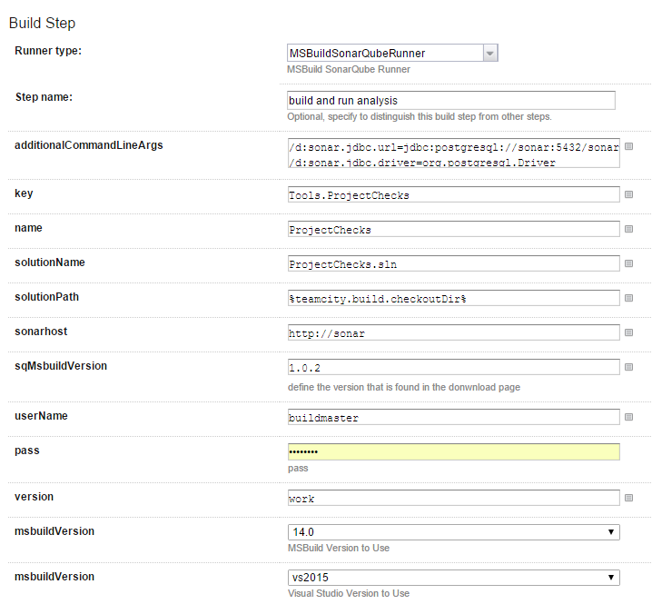

# SonarQube MSbuild Runner

This metarunner wraps SonarQube msbuild runner in a simgle teamcity step. 

## Settings

1. addionalCommandLineArgs: pass additional arguments to support your workflow
2. key (mandatory parameter): the key of the project
3. name (mandatory parameter): the name of the project
4. solutionName (mandatory parameter): solution name to build (ex: solution.sln)
5. solutionPath (mandatory parameter): folder where solution is found
6. sonarhost (mandatory parameter): server address
7. sqMSbuildVersion (mandatory parameter): version of the runner to use, see next section for detaols
8. userName, pass (mandatory parameter): credentials of user
9. version (mandatory parameter): project version
10. msbuildVersion, visualStudioVersion: visual studio version to use

## Specifing msbuild runner version to use
This meta runner will download the msbuild runner during its execution. the donwload path is for example: https://github.com/SonarSource/sonar-msbuild-runner/releases/download/1.0.2/MSBuild.SonarQube.Runner-1.0.2.zip, so we would specify 1.0.2 to use this version

## Import Coverage Results
By default the meta runner will import opencover and nunit reports. The automatic execution of the tests and coverage is done using https://www.nuget.org/packages/NunitRunnerTask. 

All its needed is to install this package for each test project: Install-Package NunitRunnerTask