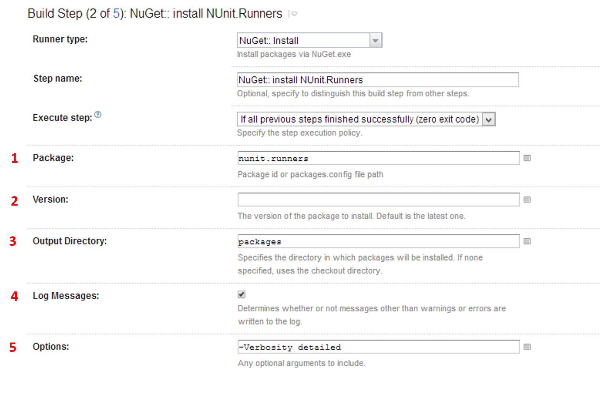

## What?
Sometimes you just want to install something from NuGet as part of a build that can't be handled via package restore. Then this meta-runner is for you.

## Prerequisites etc.
You need to turn on the nuget command-line feature in TeamCity since this meta-runner uses the default nuget.exe that you have configured.

## Example
An example could be to install [NUnit.Runners](http://www.nuget.org/packages/NUnit.Runners/) as part of a build configuration and then use it in a later step.

### 1. Package
The name of the package to install. Could also be the path to packages.config file.

### 2. Version
If you don't want the latest version.

### 3. Output Directory
Where the package ends up.

### 4. Log Messages
Logs extra information for debugging purposes.

### 5. Options
Sends extra [options/arguments](http://docs.nuget.org/docs/reference/command-line-reference#Install_Command_Options) to the NuGet Install command.
