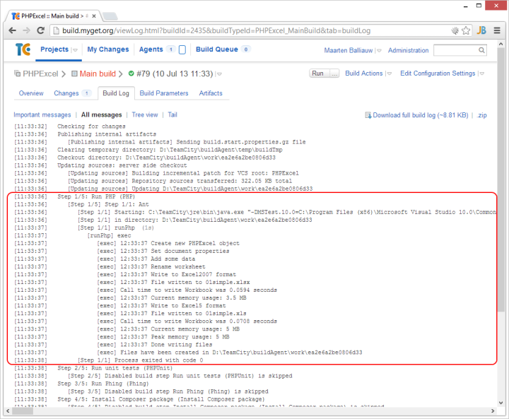
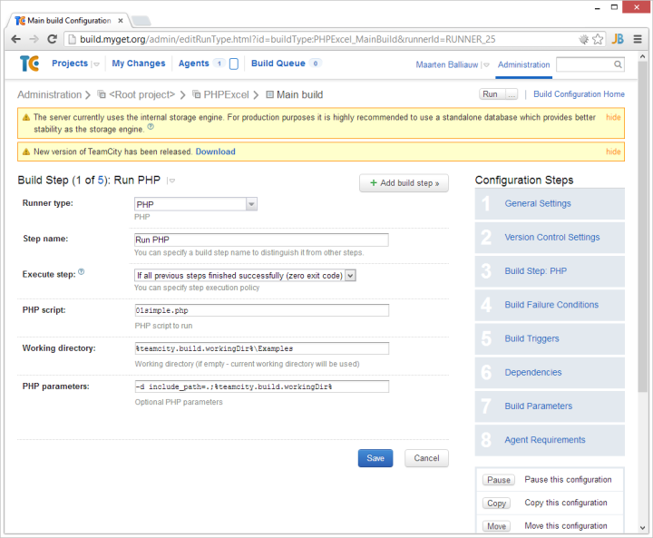
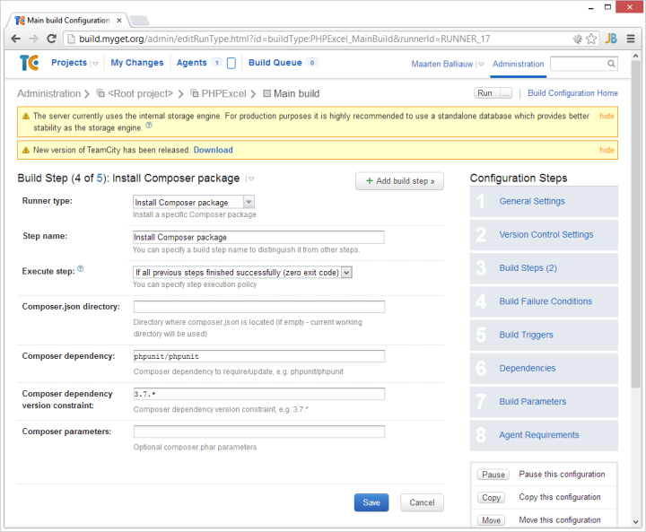
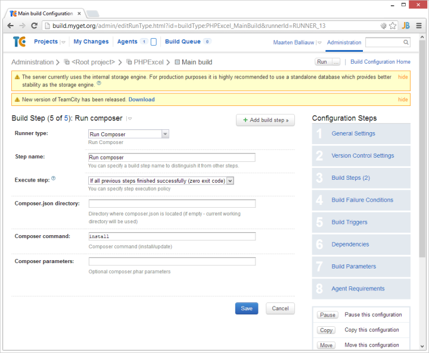
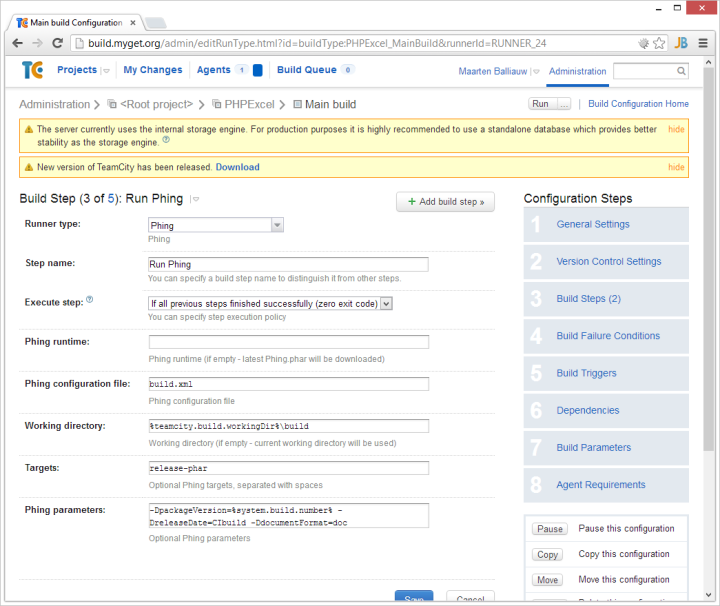
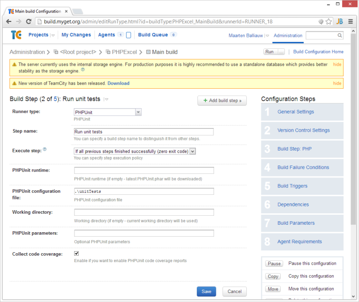
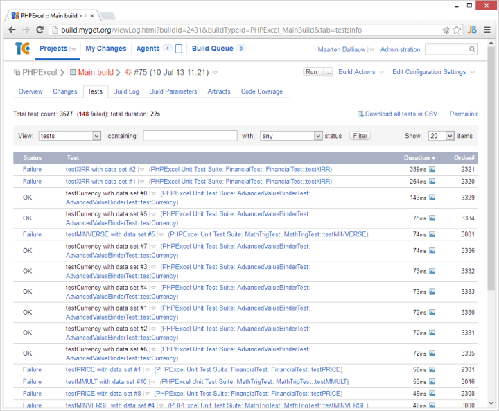
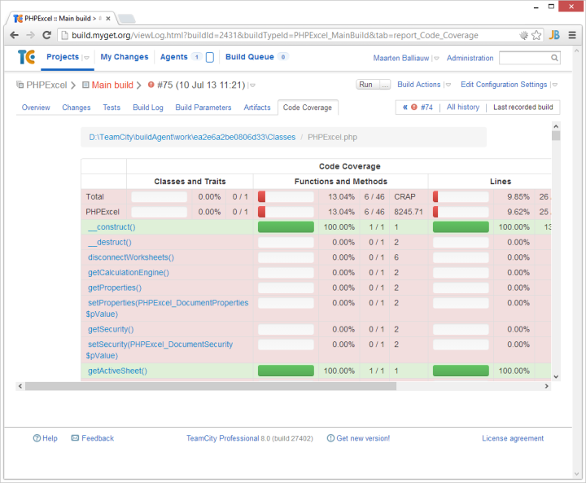

# PHP meta-runners for TeamCity
The [Meta-runner Power Pack for TeamCity 8](https://github.com/jetbrains/meta-runner-power-pack) contains a set of PHP-related meta runners:

* Run arbitrary PHP code using the _PHP_ runner
* Install a specific Composer dependency using the _Install Composer package_ runner
* Install/update packages from composer.json using the _Run Composer_ runner
* Run Phing build script using the _Phing_ runner
* Run PHPUnit tests (with code coverage reporting) using the _PHPUnit_ runner

Before being able to use these runners, the following prerequisites should be satisfied:

* Make sure that a PHP runtime is available on the build agents and that it is enlisted in the `PATH` variable.
* Install the meta runners into your project by following instructions at [https://github.com/jetbrains/meta-runner-power-pack](https://github.com/jetbrains/meta-runner-power-pack)

Most runners will report back their output in the TeamCity build log. The following is the output of the _PHP_ runner:

## PHP Runner
The _PHP_ runner allows running arbitrary PHP code. 

The following options can be specified:

* **PHP script**: The PHP script to run.
* **Working directory**: The working directory to use. If omitted, the current working directory will be used.
* **PHP parameters**: Additional parameters for the PHP command line.

## Install Composer package runner
The _Install Composer package runner_ allows installing a given Composer dependency during the build.

This build step will automatically download _composer.phar_ from the [GetComposer.org](http://www.GetComposer.org) website during build.

The following options can be specified:

* **Composer.json directory**: The directory where composer.json is located. Note that a composer.json file must exist in this directory for the runner to work.
* **Composer dependency**: The Composer dependency to install, for example _phpunit/phpunit_.
* **Composer dependency version constraint**: A version constraint for the Composer dependency, for example _3.7.*_.
* **Composer parameters**: Additional parameters for the Composer command line.

## Run Composer runner
The _Run Composer_ runner allows installing or updating Composer dependencies during the build.

This build step will automatically download _composer.phar_ from the [GetComposer.org](http://www.GetComposer.org) website during build.

The following options can be specified:

* **Composer.json directory**: The directory where composer.json is located. Note that a composer.json file must exist in this directory for the runner to work.
* **Composer command**: Either _install_ or _update_, depending on the use case.
* **Composer parameters**: Additional parameters for the Composer command line.

## Phing runner
The _Phing_ runner allows running a Phing script during the build.

This build step will use a Phing executable available on the build agent if specified, or automatically download the latest _phing-latest.phar_ from the [Phing.info](http://www.phing.info) website during build.

The following options can be specified:

* **Phing runtime**: The Phing executable to use during build. If omitted, the latest Phing version will be downloaded during build.
* **Phing configuration file**: The build.xml file to run.
* **Working directory**: The working directory to use. If omitted, the current working directory will be used.
* **Targets**: The build targets to be run, separated by spaces.
* **Phing parameters**: Additional parameters for the Phing command line.

## PHPUnit runner
The _PHPUnit_ runner allows running PHPUnit tests during the build and will optionally publish code coverage results to TeamCity.

This build step will use a PHPUnit executable available on the build agent if specified, or automatically download the latest _phpunit.phar_ from the [PHPUnit.de](http://www.phpunit.de) website during build.

The following options can be specified:

* **PHPUnit runtime**: The PHPUnit executable to use during build. If omitted, the latest PHPUnit version will be downloaded during build.
* **PHPUnit configuration file**: The path where the phpunit.xml file resides, or a full path to a specific PHPUnit configuration.
* **Working directory**: The working directory to use. If omitted, the current working directory will be used.
* **PHPUnit parameters**: Additional parameters for the PHPUnit command line.
* **Collect code coverage** Enables code coverage analysis and reporting for the test run.

The _PHPUnit_ runner will report unit test results to the TeamCity server:

When the **Collect code coverage** option is enabled, the _PHPUnit_ runner will publish a code coverage report to the TeamCity server:

