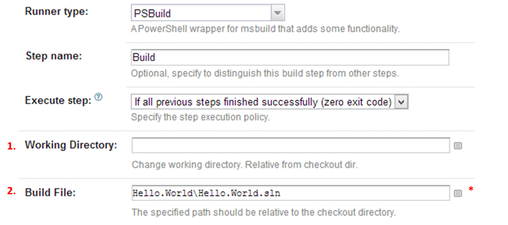
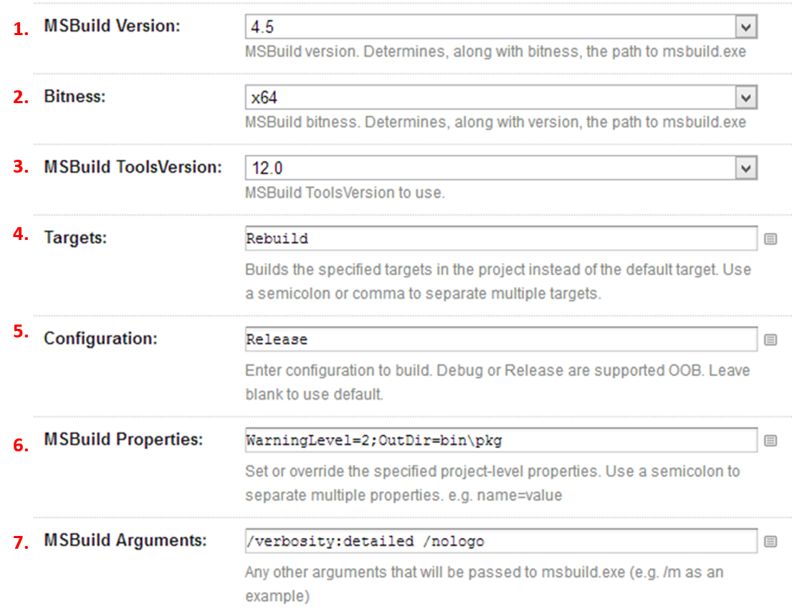
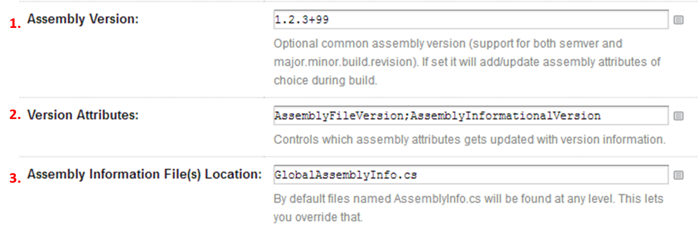
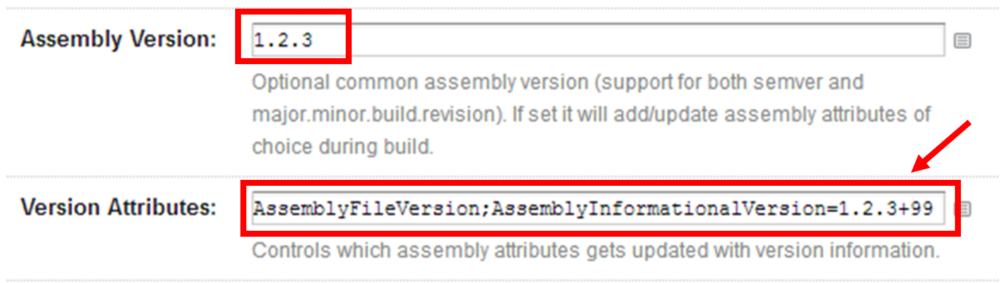

# PSBuild
PSBuild is a windows only meta-runner that wraps MSBuild and supports versioning (SemVer also) OOB. It's sort of like MSBuild on steroids.

It's built using PowerShell and thus will require you to have PowerShell (v3 or higher)  and .NET installed on your system.

**Limitations**: Only works for C# projects (2013-12-10)

## Settings
PSBuild is meant to work more or less without configuration but below is a listing of the things you can alter and how they work OOB.

---

### General

#### 1. Working Directory
By altering this path you can tell the script to execute from another working directory. By default your checkout directory is the working directory.

#### 2. Build File
**Required**: The path to the solution or project you want to build.

---

### MSBuild

#### 1. MSBuild Version
Along with bitness, determines the path where PSBuild will look for the msbuild executable.
This closely relates to the version of .NET framework that you're using. Default is 4.5

#### 2. Bitness
x64 or x86. Determines where, along with MSBuild version,  PSBuild will look for the msbuild executable. Default is x86

#### 3. ToolsVersion
Specifies the version of the [toolset](http://msdn.microsoft.com/en-us/library/vstudio/bb383796.aspx) to use to build the project. Default is 12.

#### 4. Targets
Builds the specified [targets](http://msdn.microsoft.com/en-us/library/vstudio/ms171462.aspx) in the project. Separate them by semicolon. If not set it will the default one.

#### 5. Configuration
Configuration/s to build. This overrides the default one/s specified in the solution/project file.

#### 6. Properties
Set or override the specified project-level [properties](http://msdn.microsoft.com/en-us/library/vstudio/ms171458.aspx). e.g. *name=value* where name is the property name and value is the property value. Use a semicolon or comma to separate multiple properties.

#### 7. Arguments
Any other [arguments](http://msdn.microsoft.com/en-us/library/vstudio/ms164311.aspx) that will be sent along to msbuild.exe 

---

### Assembly Version
These settings configures whether or not assembly attributes will be stamped during the build phase to represent a version number.

#### 1. Assembly Version
This sets a "global version" that all the attributes will receive (if not overridden). This also supports [semantic versioning](http://semver.org/) and will "lift out" the build metadata part (e.g. +99) from attributes that doesn't support it.

#### 2. Assembly Attributes
Configure which assembly attributes (you can use any attribute you want as long as they are assembly scoped) that will be stamped during build. Separate them by semicolon. If you leave it blank it will use **AssemblyVersion, AssemblyFileVersion** and if you use a SemVer the **AssemblyInformationalVersion** will also be stamped.

#### 3. Assembly Information File(s) Location
By default PSBuild will look for files names *AssemblyInfo.cs* in your working directory and recursive downwards. This property lets you specify another way to find the file/s you wish to stamp.

----------

#### Alternative/Custom Version

If you want to you can use a global version and then optionally "override" that version in one or more attributes as the image above shows.
The syntax for this is **attribute-name=custom-version** (i.e. key=value).

In this example the **AssemblyFileVersion** attribute would get version *1.2.3* and the **AssemblyInformationalVersion** would get version *1.2.3+99*

---

**More Information**: I've written a blog post [here](http://wp.me/pBlgt-xL "Introducing the PSBuild meta-runner (for .NET)") that explains some more details.

