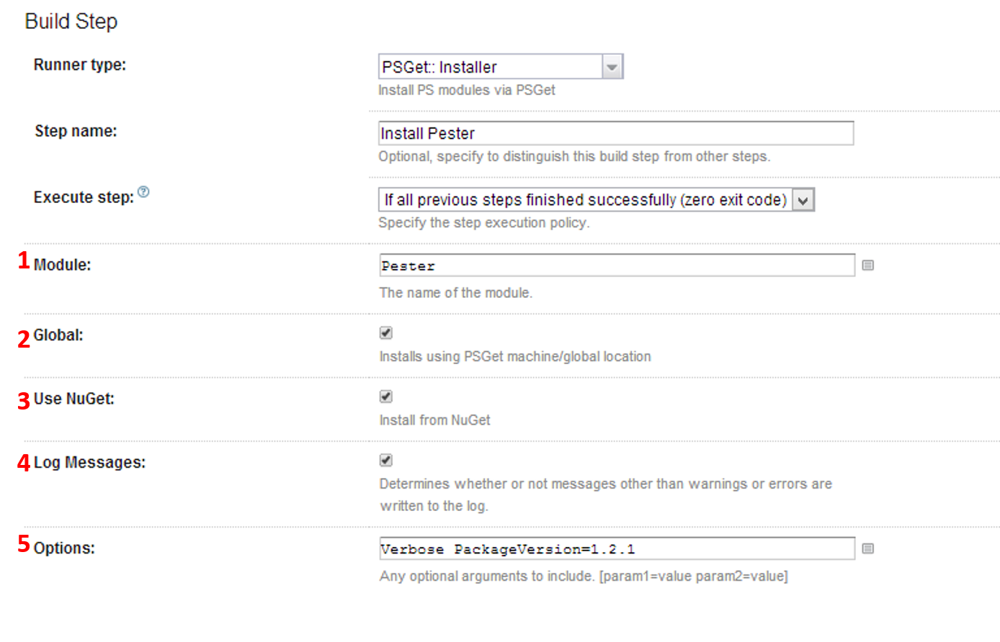

## What?
PSGet-Install is a meta-runner that you'd use for installing PowerShell modules as part of a build.
[PSGet]([https://github.com/psget/psget) is simply a set of commands that lets you install PS modules from a central directory, local system, url of your choice, or nuget.

## Example
An example could be to install [Pester]([https://github.com/pester/Pester](https://github.com/pester/Pester)) as part of a build configuration and then use it in a later step.

### 1. Module
The name of the module to install

### 2. Global
Installs the module into *CommonFiles\Modules*

### 3. Use NuGet
By default, PSGet uses the central repository. This switch lets your use nuget as a source instead.

### 4. Log Messages
Logs extra information for debugging purposes.

### 5. Options
Sends extra [options/arguments](https://github.com/psget/psget/blob/master/PsGet/PsGet.psm1#L20) to the PSGet Install command.
