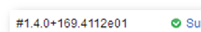
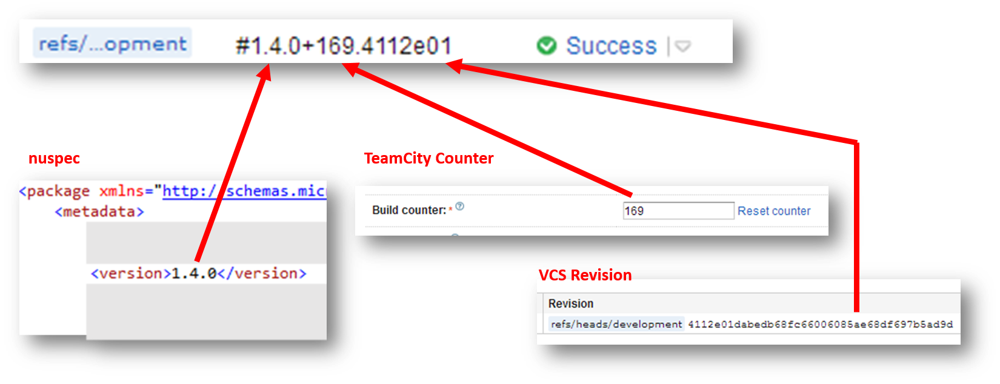
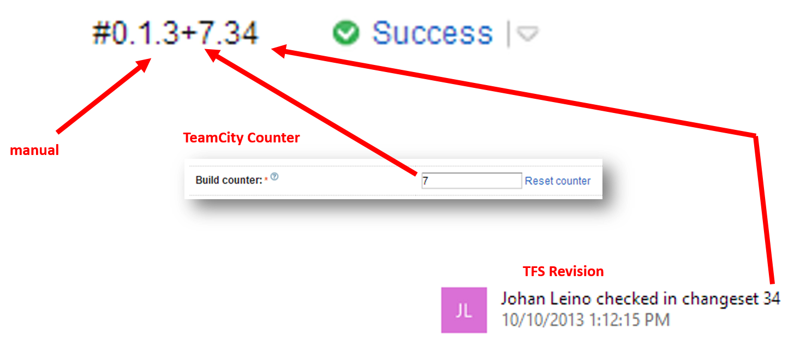
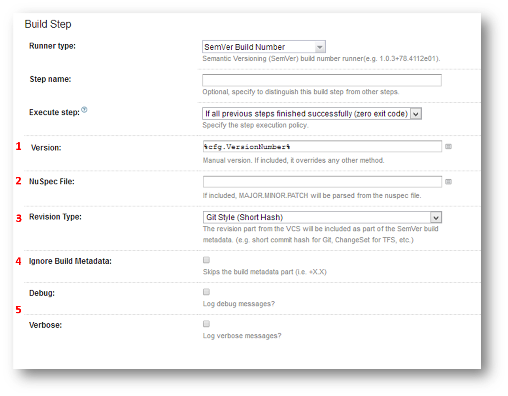
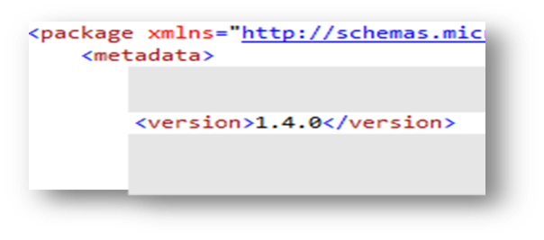

## What?

SemVer is a meta-runner that automates some parts of constructing a build number that uses [Semantic Versioning](http://semver.org/). 

The SemVer Build Number meta-runner is a runner based on **PowerShell**. It can:

* Get version numbers from nuspec (nuget) files.
* Use manual version numbers (from parameters if you need that). Overrides other methods.
* Include TeamCity build counter.
* Include VCS revision.
* Translate Git commit hash to short hash.
* Ignore Build MetaData if needed.
* Logging etc.

## Examples

## Options

### 1. Version
If you use this field it overrides any other methods of getting the version number part of SemVer.
How you supply the information is up to you (manual, previous build step, parse xml file …etc.??)

### 2. NuSpec Version
Sometimes it might be nice to get the version from a .nuspec file if you're building a nuget package for example.
This field contains the path (relative from checkout dir) to such a file and “lifts” the version from the file if it can.

### 3. Revision Type
* Skip it – not included
* Use standard – gets the information from the latest VCS revision included in the build, %build.vcs.number%.
* Use Short Hash – same as above but it shortens the hash…git style.

### 4. Ignore MetaData
Skips the +x.x part

### 5. Logging
Logs some extra information.
