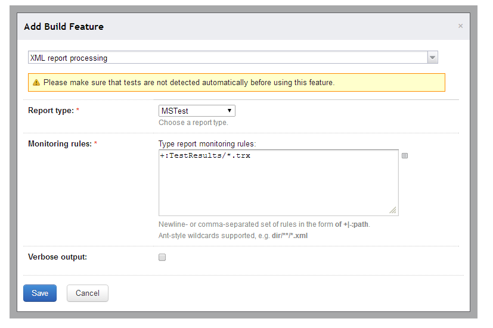

## What?

VSTest is a meta runner that enables TeamCity to run automatic tests with [vstest.console](http://msdn.microsoft.com/en-us/library/jj155800.aspx) tool and gather code coverage.

## Options

### 1. Path to VSTest
Should contain full path to vstest.console executable. Table below contains default paths for vstest.console.exe inside various VisualStudio distributions:

| VisualStudio&nbsp;Version  | Default Path |
|-------------|-------------|
|2012  | C:\Program Files (x86)\Microsoft Visual Studio 11.0\Common7\IDE\CommonExtensions\Microsoft\TestWindow\vstest.console.exe |
|2013  | C:\Program Files (x86)\Microsoft Visual Studio 12.0\Common7\IDE\CommonExtensions\Microsoft\TestWindow\vstest.console.exe |

### 2. Assemblies with tests
Should contain path to assemblies with tests, relative to build directory

### 3. Extra Command Line
Extra [command line options](http://msdn.microsoft.com/en-us/library/jj155796.aspx) that will be passed to vstest.console.exe

### 4. Coverage Rules
[Filters](http://confluence.jetbrains.com/display/TCD8/JetBrains+dotCover) for bundled dotCover

## Additional setup. Test reporting.

This runner makes vstest.console report tests in standard trx format. For TeamCity to consume these reports you must add build feature 'XML Report Processing' with MSTest selected as report type as shown on the example below

