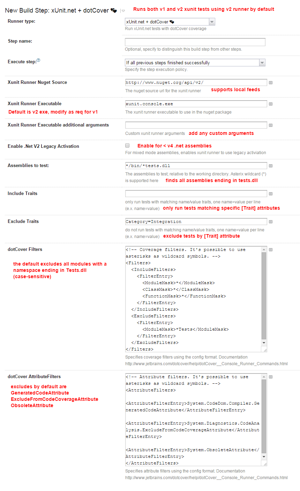

xUnit.net + dotCover meta-runner for TeamCity
==================================

This meta-runner runs [xUnit.net](https://github.com/xunit/xunit) tests inside of TeamCity and includes dotCover coverage reports.

Full details can be found @
http://www.wwwlicious.com/2015/09/25/teamcity-dotcover-xunit-at-last/ 

Requirements
------------

* Nuget to be [configured on the TeamCity server](https://confluence.jetbrains.com/display/TCD9/NuGet).
* A [local or remote nuget feed](https://docs.nuget.org/create/hosting-your-own-nuget-feeds) accessible by all build agent servers containing the xunit console runner package.
 
What it does
------------
 
* downloads the latest available console runner from a local or remote nuget feed
* uses wildcard searching to find and run xUnit.net tests
* provides dotCover coverage reporting and statistics back to Teamcity.
* return error codes to fail builds.
* Supports both xUnit.net v1.x and v2.x test assemblies.

Artifacts
---------

The following files are published as build artifacts by this runner

* dotCover configuration xml
* dotCover logs
* coverage files (*.dcvr)

Configuration Option Defaults*
-----------------------------

*Editable as required

