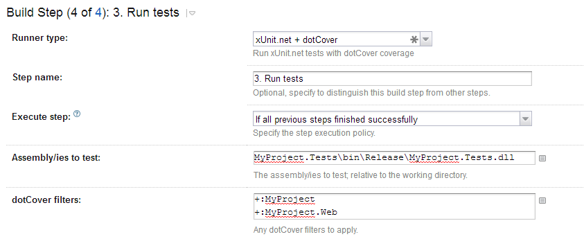

xUnit.net meta-runner for TeamCity
==================================

This meta-runner allows you to run [xUnit.net](https://github.com/xunit/xunit) tests inside of TeamCity without needing to install anything further on your server. It will automatically install the xUnit runner from Chocolatey after ensuring Chocolatey exists on that server (it installs Chocolatey for you if it's not already there). It will then execute xUnit against the dll(s) you provide and output the appropriate test statuses to TeamCity.

xUnit.net Runner
----------------

The following options can be specified:
* Assembly/ies to test - The list of assemblies to test with paths relative to the working directory
* dotCover Filters - List of filters for dotCover code coverage

Known Issues
------------

1. Once this gets an xunit installed on the server from Chocolatey it will never try and update it - It could include a call to cinst to update it if necessary every run, but that will add at least 1-2s (if not more) to every build run due to Chocolatey's slowness. That's why it checks the filesystem for chocolatey rather than invoking a Chocolatey command to see if it already exists.
2. Due to difficulties passing dynamic variables between meta-runner runners this meta-runner only works with Chocolatey > 0.9.8.27 and where Chocolatey is installed to C:\ProgramData\Chocolatey
3. Currently this meta-runner is hardcoded to use dotCover
